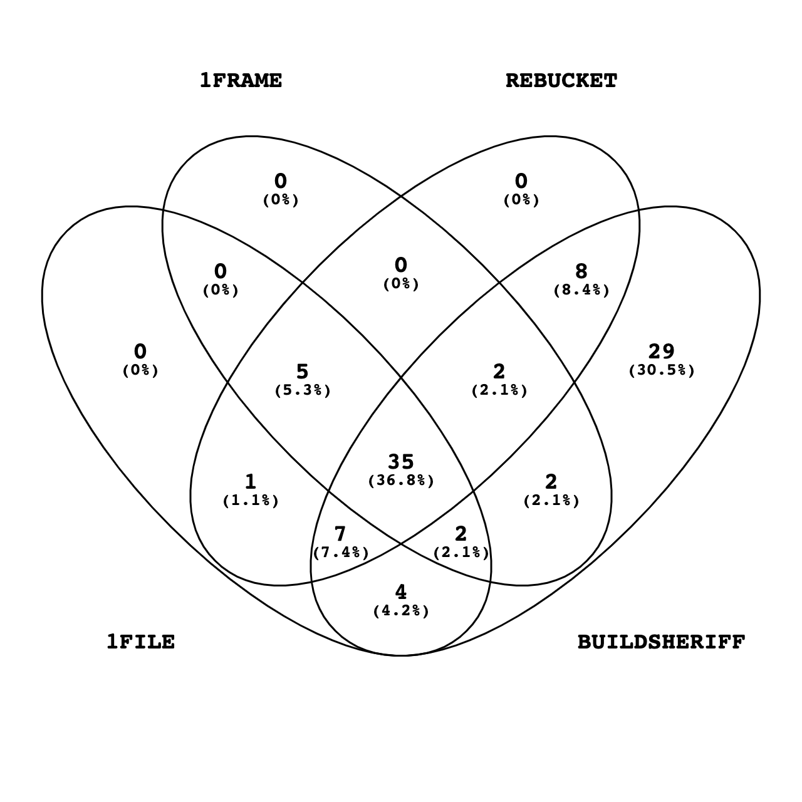

---
# Feel free to add content and custom Front Matter to this file.
# To modify the layout, see https://jekyllrb.com/docs/themes/#overriding-theme-defaults

layout: default
---

 Test failure is one of the commonest reasons for broken builds in continuous integration. It is time-consuming to diagnose all test failures in a build. As test failures are often caused by a few underlying faults, triaging test failures with respect to their underlying root causes can reduce test failure diagnose cost. Existing failure triage methods are mostly developed for triaging crash or bug reports, and hence not applicable in the context of test failure triage in continuous integration. In this paper, we first present a large-scale empirical study on 163,371 broken builds caused by test failures to characterize test failures in real-world Java projects. Then, motivated by our study, we propose a new change-aware approach, BuildSheriff, to triage test failures in each continuous integration build such that test failures with the same root cause are put in the same cluster. Specifically, we design a pipeline of three strategies based on complexity of code changes, change-aware stack trace similarity, and exception message similarity to triage one type of test failures, i.e., exception failures, and a pipeline of two strategies based on complexity of code changes and change-aware test code similarity to triage the other type, i.e., assertion failures. Our evaluation on 200 broken builds has demonstrated that BuildSheriff can significantly improve the state-of-the-art (e.g., by 45%+ on the number of correctly triaged builds, and 15%+ on BCubed F-Measure.)

### Venn diagrams

Intersections of Exception Failures

Intersections of Assertion Failures

### Code and Dataset
<ul>
  <li><a href="files/code.7z" download>Source Code</a></li>
  <li><a href="files/data.7z" download>Data</a></li>
</ul>